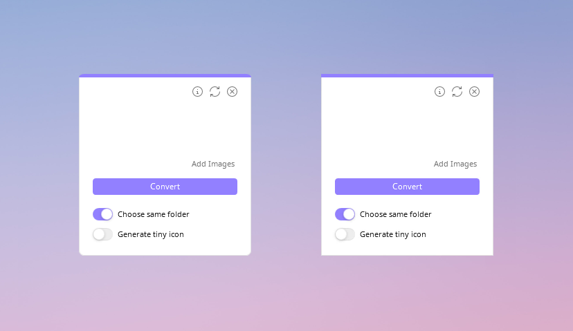

<h1 align="center">Drop Icons</h1>

Drop Icons es una aplicación para convertir imágenes a iconos (.ico) para Windows, con una función simple de arrastrar y soltar.

 
 
  
 
 

<b>• Lenguajes Compatibles •</b>
 
‎ ‎ ‎ ‎ ‎ ‎ ‎ ‎ ‎ ‎ ‎ ‎ 

<a href="README.md">README - English</a> :speech_balloon: <a href="README-es.md">README - Español</a>

## Características
* Interfaz limpia e intuitiva.
* Convierte rápidamente muchas imágenes en iconos a la vez, con la función de arrastrar y soltar.
* Compatibilidad con imágenes .png .jpg .jpeg .jfif .bmp .gif y .svg
* Personaliza el color del tema.
* Número de las imágenes a convertir, restando tres que se muestran como vista previa.
* Guarda la configuración en un archivo .ini, excepto para los switches.
* Guarda los iconos en la misma carpeta (por defecto) o en una específica.
* Habilita y deshabilita Topmost.
* Opciones de formato para elegir los tamaños incluidos dentro del icono, múltiple y 256 px. [𝐢](#details)
* Evita la duplicación de una imagen que se ha añadido previamente.
* Opción para generar un icono mini.
* Esquinas adaptables (redondeadas o metro), dependiendo la versión del sistema operativo.

## Previa

## Uso
Arrastra y suelta tus imágenes en el espacio vacío, obtendrás una vista previa de tres imágenes excepto si solo arrastras una o dos. Más abajo puedes ver la cantidad total de imágenes a convertir, restando tres de la previa. Si no puedes arrastrar, cliquea en `Agregar`.

Deja el primer switch activado si deseas guardarlos en la misma carpeta, si prefieres elegir una carpeta específica, desactívalo. También puedes generar un icono mini activando el segundo switch. Por último, haz clic en el botón `Convertir`, espera a que la interfaz se reinicie porque eso indica que ha finalizado y tus iconos están listos.

Si necesitas eliminar las imágenes que agregaste por error, haz clic en el icono de las flechas. Recuerda que puedes arrastrar imágenes tantas veces como quieras antes de hacer clic en el botón `Convertir`.

 
Dando click en el botón superior de Info, aparecerá una nueva ventana en la que puedes:

- **Cambiar el tema:** Haz clic sobre `Cambiar Tema` para abrir el selector de color y elegir uno personalizado, cuando lo tengas da clic en Aplicar. Para regresar al color por defecto repite los pasos anteriores y presiona el botón morado debajo del selector de tono, finalmente haz clic en Aplicar.

- **Cambiar el idioma:** En la sección inferior **Idioma**, haz clic en el icono de las flechitas para cambiar entre English, Español o Deutsch. Por último da clic en el botón de regresar para aplicar y ver los cambios.
 
- **Formato:** Al hacer clic en `Formato` se desplegará un menú con dos opciones para elegir los tamaños que serán incluidos dentro del icono: **Múltiple** genera un icono de alta calidad que incluye todos los tamaños necesarios como 16, 32, 48, 64, 128 y 256 pixeles, aunque sus dimensiones mostrarán solo 16px. Las dos últimas opciones son **256 px** y **512 px**, las cuales generan un icono con solamente ese tamaño.
     >Nota: Si el switch **Generar icono mini** está activado, se creará un icono pequeño independientemente de su formato.

- **Contenido de terceros:** En la parte izquierda están los nombres de cada librería, proyecto, iconos o tipografías que fueron utilizados, cliquea uno para leer su licencia y autor(a) o autores(as), además de una corta descripción. Puedes hacer clic sobre el icono de clip para ir al repositorio/sitio oficial de cada uno y cambiar de página con **Siguiente 🢖🢖** o **🢔🢔 Atrás**.

 

Para elegir que Drop Icons esté encima de todas las ventanas (Topmost) o no, da clic derecho en cualquier lugar de la ventana principal y elige Habilitar Topmost o Deshabilitar Topmost.

## Opciones

## Instalador
Para compilar el instalador es necesario [Inno Setup](https://jrsoftware.org/isinfo.php), los archivos se encuentran en la carpeta [installer src](/installer%20src). Solo debes abrir el proyecto (Installer.iss) y compilarlo, a menos que desees hacer una modificación. Al finalizar, en la misma ubicación dejará una carpeta llamada Output.

>* Por favor, toma en cuenta que primero debes compilar el código de fuente en Visual Studio para tener los binarios, de lo contrario obtendrás un [📍Compiler Error](https://github.com/genesistoxical/drop-icons/issues/3).
>* Si lo prefieres, puedes descargar la app compilada en la [página](https://genesistoxical.github.io/drop-icons/) de Drop Icons.

**Portable with 7zip.bat** permite comprimir en .zip rápidamente la versión portable. Únicamente funciona con [7zip](https://www.7-zip.org/).

Ambos .iss y .bat obtienen los archivos que son necesarios dentro de su carpeta y/o la carpeta Release (debido a las rutas relativas).

## Contribuciones
* El paquete **HandyControls** dejará de actualizarse (por ahora o permanentemente) ya que la última versión no permite cambiar el tamaño de ToggleButtonSwitch.
* Si haces comentarios en el código, preferiblemente en Español, por favor.
* Los nombres de las variables deben estar en Inglés.
* Si abres un **Issue**, puede ser en Inglés o Español.
* **Pull request** en Inglés, en la descripción puedes agregar detalles en Inglés o Español.
  
## Configuración
El archivo `Config.ini` almacena información del lenguaje, color del tema, format de icono y si está activada o no la opción TopMost.

~~~
[Options]
Language = en
Topmost = false

[Theme]
#FF9280FF

[Format]
Size = multiple
~~~

>Nota: las dos opciones de tipo switch no se guardan porque no son opciones que suelan activarse todo el tiempo.

## Esquinas adaptables

# Creditos
Drop Icons está basado en [Iconizer](https://github.com/willnode/Iconizer) bajo [MIT License](https://github.com/willnode/Iconizer/blob/master/LICENSE).

* [HandyControls](https://github.com/ghost1372/HandyControls) bajo [MIT License](https://github.com/ghost1372/HandyControls/blob/develop/LICENSE).

* [FolderBrowserEx](https://github.com/evaristocuesta/FolderBrowserEx) library bajo [MIT License](https://github.com/evaristocuesta/FolderBrowserEx/blob/master/LICENSE).

* [Noto Music](https://fonts.google.com/noto/specimen/Noto+Music) bajo [SIL Open Font License](/src/DropIcons/Docs/Noto%20Music/OFL.txt).

* Los iconos son parte de [Teenyicons](https://github.com/teenyicons/teenyicons) bajo [MIT License](https://github.com/teenyicons/teenyicons/blob/master/LICENSE).

* [SVG](https://github.com/svg-net/SVG) bajo [MS-PL license](https://github.com/svg-net/SVG/blob/master/license.txt).
 Este paquete incluye cinco dependencias, lee más detalles en este [archivo](/src/DropIcons/Docs/SVG%20%2B.txt).

* [WinVersion](https://github.com/shaovoon/win_version_detection) detection bajo [MIT License](https://github.com/shaovoon/win_version_detection/blob/main/LICENSE).

*Puedes encontrar todas las licencias [aquí](/src/DropIcons/Docs).*

 

✨ Agradecimientos especiales por las traducciones:
* German Translation por **uDEV2019**.
* Simplified Chinese Translation por **huqiu2**.
* French Translation por **logounet**.

## ¿Qué es lo nuevo?
`Versión 3.1.0` incluye un idioma más: [📍German translation](https://github.com/genesistoxical/drop-icons/pull/6) tanto en la aplicación como en el instalador. Para evitar problemas con la interfaz, se han deshabilitado las actualizaciones para el paquete **HandyControls**.

 

`Versión 3.2.0` incluye otro idioma: [📍Simplified Chinese language](https://github.com/genesistoxical/drop-icons/issues/8), solo para la aplicación.

 

`Version 3.6.0` se agregó otra traducción (Wow, gracias): [📍French language](https://github.com/genesistoxical/drop-icons/issues/9), solo para la aplicación. También se incluyó la opción para crear íconos de 512px en **Formato** [📍Please add 512 px](https://github.com/genesistoxical/drop-icons/discussions/10).

Ahora la opción **Lenguaje** se despliega y aparece un tooltip al mantener encima el cursor, para mostrar los créditos.

## Licencia
**MIT License**

Copyright (c) 2022 - 2025 Génesis Toxical ([read here](LICENSE)).

 

## Relacionado:
`🩷 Image to Icon` Convertir imagen a icono online:  [`genesistoxical.github.io/imagetoicon`](https://genesistoxical.github.io/imagetoicon/) o [`Repositorio`](https://github.com/genesistoxical/imagetoicon).

`🩷 Pixie Folders` Set con seis diseños de iconos de carpetas minimalistas y editables: [`Descargar`](https://genesistoxical.github.io/pixie-folders/) o [`Repositorio`](https://github.com/genesistoxical/pixie-folders).
