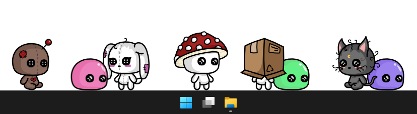

<h1 align="center">Droplet Screenmate</h1>

Droplet Screenmate, una mascota corriendo por tu escritorio.

 
 
  

<a href="README.md">English</a> :speech_balloon: <a href="README-es.md">Español</a>

## Características
* Tu mascota detecta la barra de tareas y camina por encima de ella.
* Puedes arrastrarlo y soltarlo en cualquier otra parte de tu escritorio.
* Animaciones diferentes al caminar, detenerse, sentarse y arrastrar.
* Elige entre los 8 skins por defecto.
* Opciones para cambiar la velocidad en la que camina.
* Opción de iniciar al encender tu PC.
* Puedes crear tu propio skin usando las plantillas (PNG y editables).

## Preview

## Uso
Lo único que debes hacer es ejecutar **Droplet Screenmate.exe**. ¡Y listo! Aparecerá tu mascota caminando sobre tu barra de tareas, no solo eso, también se detiene, se sienta e incluso basta con que lo arrastres y lo sueltes para cambiarlo de lugar. De hecho, también tiene una animación especial cuando lo estás arrastrando.

 

Dirígete al icono que está en tu bandeja, dale click derecho: 

**Options** abrirá la ventanita de opciones de la mascota:

* En el apartado de _Skin_, solo despliega, elige uno y da click en OK. ¡Eso es todo!
* Para cambiar qué tan rápido camina y qué tan largos da los pasos, ve al apartado de _Config_:
  * _Velocity_: Entre mayor sea el valor, más rápido se moverá.
  * _Step Size_ Entre menor sea el valor, más cortos serán los pasos.

  Puedes usar estas combinaciones al crear tu skin personalizado, dependiendo si se arrastra, si salta, etc.

**Run at Startup**: Actívala para que se inicie al momento que enciendes tu PC, puedes desactivarla también cuando desees. IMPORTANTE; una vez que actives esta opción, si vuelves a mover la carpeta de **Droplet Screenmate** de lugar ya no se iniciará con tu PC, aunque tenga el check. Únicamente debes desactivarla y activarla nuevamente.

**About**: Licencia MIT, créditos y enlace al respositorio.

**Exit**: Cierra la aplicación. Sin embargo, cuando vuelvas a abrirla nuevamente, tu configuración y skin seguirán siendo los mismos ya que todo se guarda en archivos _Config.ini_

 

  

## Contribuciones
* Si haces comentarios en el código, preferiblemente en Español, por favor.
* Los nombres de las variables deben estar en Inglés.
* Si abres un **Issue**, puede ser en Inglés o Español.
* **Pull request** en Inglés, en la descripción puedes agregar detalles en Inglés o Español.
* Debido a la simplicidad y optimización que se requiere en esta aplicación, no se harán traducciones.
  
## Configuración
El archivo `Config.ini`primario, almacena qué skin se utilizó por última vez.

~~~
[Options]
Skin = Mushroom
~~~

El archivo `Config.ini` del skin almacena su propia configuración.

~~~
[Config]
Velocity = 0.2
Step size = 12
~~~

## Licencia
**MIT License**

Copyright (c) 2026 Génesis Toxical ([read here](LICENSE)).

 

## Related:
`❤️ Q'zero Cursor` Black cursor with danger style: [`Descarga`](https://genesistoxical.github.io/qzero-cursor/) o [`Repositorio`](https://github.com/genesistoxical/qzero-cursor).
