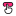

<h1 align="center">Pixie Cursors</h1>

Pixie Cursors is an app to create your own custom cursors.

 
 
  
 
 

<a href="README.md">English</a> :speech_balloon: <a href="README-es.md">Español</a>

## Features
* Create cursors in just a few minutes.
* Intuitive and simple interface.
* Full-time, real-size preview.
* Import a PNG image and crop empty margins.
* Choose where the cursor will click (Hotspot).
* Color picker that allows you to save swatches.
* Button to add a shadow at the end of the cursor.
* The editor's checkered background can be darkened.
* Access tools with keyboard shortcuts.
* Switch between English and Spanish language.

## Preview

## Usage
It's very easy to use, as it's an editor like any other. If you have questions about a tool or button, hover over it (without clicking) to get information.

- Open an image  (it must be in PNG format). The margins with empty pixels will be automatically cropped.
- Start creating the arrow; use the brush, colorpicker and your creativity. Once you select the brush, you can also erase with a right-click.
- Once finished, you can add a shadow . A lot of shading is usually added to the arrow so you can refine it by erasing a bit.
- Select  from toolbar to choose where you want your cursor to click, such as the arrowhead. Click to place the circle where you want it.
- Press the save button , put it a name, and you're done. Now let's install it...

**Installation:**
- Open your cursors folder with the  button and move the cursor you just created there.
- Click , which is just a shortcut to the Windows Mouse Properties.
- In the window that opens, go to **Pointers**, click **Normal Selection** and `Browse` to choose a different one. Go to **- Pixie Cursors -** folder and select your cursor. You can do the same with the link or hand cursor.
- Press `Save As...`, put it a name and `OK`.
- Uncheck the **Enable Drop Shadow** box to avoid a double shadow, click `OK` and that's it! Enjoy your cursor!

**Other tools:**
- If **Crop Empty Margin** is enabled when opening an image, it will be cropped to get the best cursor size.
- Hold `Shift` when using brush to draw a line.
- Press `Ctrl` when using paint bucket or *Fill* to paint all pixels the same color.

 

  

By clicking on , a new window will appear in which you can:

- **Change language:** In the **Language** section below, click on the little arrows icon to change between English or Español. Finally click on the return button to apply and see changes.
     
- **Third-party content:** On the left side are the names of each library, project, icons or fonts that were used, click one to read its license and author(s), as well as a short description. You can click on the clip icon to go to each repository/official site and change pages with **Next 🢖🢖** or **🢔🢔 Back**.

## Installer
To compile the installer you need [Inno Setup](https://jrsoftware.org/isinfo.php), the files are located in the [installer src](/installer%20src) folder. You just need to open the project (Installer.iss) and compile it, unless you want to make a change. When finished, it will leave a folder called Output in the same location.

>* Please note that you must first compile the source code in Visual Studio to get the binaries, otherwise you will get a [📍Compiler Error](https://github.com/genesistoxical/drop-icons/issues/3).
>* Alternatively, you can download the compiled app from the Pixie Cursors [page](https://genesistoxical.github.io/pixie-cursors/).

.iss Get the files that are needed within their folder and/or the Release folder (due to relative paths).

## Contributing
* If you make comments in the code, preferably in Spanish, please.
* Variable names must be in English.
* If you open an **Issue**, it can be in English o Spanish.
* **Pull request** in English, in the description you can add details in English or Spanish.
  
## Config
`Config.ini` file stores information about the language.

~~~
[Options]
Language = en
~~~

## Credits
Pixie Cursors is based on [PixelArtTool](https://github.com/unitycoder/PixelArtTool) under [MIT license](https://github.com/unitycoder/PixelArtTool/blob/master/LICENSE).

* [HandyControls](https://github.com/ghost1372/HandyControls) under [MIT License](https://github.com/ghost1372/HandyControls/blob/develop/LICENSE).

* [FolderBrowserEx](https://github.com/evaristocuesta/FolderBrowserEx) library under [MIT License](https://github.com/evaristocuesta/FolderBrowserEx/blob/master/LICENSE).

* Icons are part of [Teenyicons](https://github.com/teenyicons/teenyicons) under [MIT License](https://github.com/teenyicons/teenyicons/blob/master/LICENSE).

* [LazZiya.ImageResize](https://github.com/LazZiya/ImageResize) under [MIT License](https://github.com/LazZiya/ImageResize/blob/master/LICENSE).
 This package includes five dependencies, read more details in this [file](/src/DropIcons/Docs/SVG%20%2B.txt).

* [Noto Music](https://fonts.google.com/noto/specimen/Noto+Music) under [SIL Open Font License](/src/DropIcons/Docs/Noto%20Music/OFL.txt).

*You can find all licenses [here](/src/DropIcons/Docs).*

## License
**MIT License**

Copyright (c) 2025 Génesis Toxical ([read here](LICENSE)).

 

## Related:
`🩷 Crystal Folders` Customize your folder icons in a few seconds: [`imagetoicon.glitch.me`](https://imagetoicon.glitch.me/) or [`Repository`](https://github.com/genesistoxical/imagetoicon).

`🩷 Pixie Folders` Set of six minimalist and editable folder icon designs: [`Download`](https://genesistoxical.github.io/pixie-folders/) or [`Repository`](https://github.com/genesistoxical/pixie-folders).

`🩷 Drop Icons` Utility to convert images to icons (.ico) for Windows: [`Download`](https://genesistoxical.github.io/drop-icons/) or [`Repository`](https://github.com/genesistoxical/drop-icons/).

`🩷 Image to Icon` Convert image to icon online: [`imagetoicon.glitch.me`](https://imagetoicon.glitch.me/) or [`Repository`](https://github.com/genesistoxical/imagetoicon).
