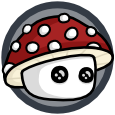
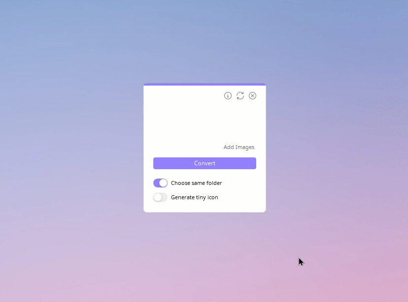
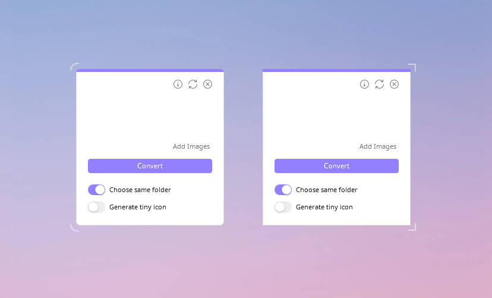

<h1 align="center">Drop Icons</h1>

Drop Icons is an app to convert images to icons (.ico) for Windows, with a simple Drag and Drop feature.

 
 
  
 
 

<a href="README.md">English</a> :speech_balloon: <a href="README-es.md">Español</a>

## Features
* Crea cursores en un par de minutos.
* Interfaz intuitiva y sencilla.
* Vista previa en tiempo y tamaño real.
* Importa una imagen en PNG y recorta píxeles vacíos.
* Elige en dónde hará clic el cursor (Hotspot).
* Selector de color que permite guardar muestras.
* Botón para agregar sombra al finalizar el cursor.
* El fondo a cuadros del editor se puede oscurecer.
* Accede a las herramientas con accesos del teclado.
* Cambia la app al idioma Inglés o Español.

## Preview

## Usage
El uso es muy sencillo, ya que es un editor como cualquier otro. Si tienes duda sobre una herramienta o botón, deja tu cursor encima de (sin dar clic), para obtener información.

- Abre una imagen  (debe ser en formato png). Los márgenes con pixeles vacíos se recortarán automáticamente.
- Comienza a crear la flechita; utiliza el pincel, selector de color y tu creatividad. Al seleccionar el pincel, puedes borrar con clic derecho también.
- Una vez terminado, podrías agregar sombra . Suele agregarse bastante sombreado a la flechita, así que puedes perfeccionarla borrando un poco.
- Selecciona  de la barra de herramientas, para elegir en dónde quieres que haga clic tu cursor, como por ejemplo, la punta de la flechita. Haz clic para dejar el circulito en el lugar que desees.
- Presiona el botón de guardar , ponle un nombre y ya lo habrás terminado. Ahora vamos a instalarlo.

Instalación:
- Abre tu carpeta de cursores con el botón  y mueve ahí el cursor que acabas de crear.
- Da clic en  el cual es solo un acceso directo a las Propiedades del Mouse de Windows.
- En la ventanita que se abrirá, dirígete a punteros, clic en "Selección normal" y “Examinar” para elegir uno diferente. Entra a la carpeta de - Pixie Cursors - y selecciona tu cursor. Puedes hacer lo mismo con el cursor de link o manita.
- Presiona “Guardar como…”, ponle un nombre y Aceptar.
- Desactiva la casilla de “habilitar sombra en el puntero” para que no se ponga doble sombra, da en Aceptar ¡Y listo, disfruta tu cursor!

Otras herramientas:
- Si está activado "Cortar Margen Vacío" al momento de abrir una imagen, este va a recortarse para otener el mejor tamaño del cursor.
- Oprime Shift al usar el pixel para hacer una línea.
- Oprime control al usar el bote de pintura o "rellenar" para pintar todos los pixeles del mismo color.

 

By clicking on , a new window will appear in which you can:

- **Change language:** In the **Language** section below, click on the little arrows icon to change between English or Español. Finally click on the return button to apply and see changes.
     
- **Third-party content:** On the left side are the names of each library, project, icons or fonts that were used, click one to read its license and author(s), as well as a short description. You can click on the clip icon to go to each repository/official site and change pages with **Next 🢖🢖** or **🢔🢔 Back**.

## Options

## Installer
To compile the installer you need [Inno Setup](https://jrsoftware.org/isinfo.php), the files are located in the [installer src](/installer%20src) folder. You just need to open the project (Installer.iss) and compile it, unless you want to make a change. When finished, it will leave a folder called Output in the same location.

>* Please note that you must first compile the source code in Visual Studio to get the binaries, otherwise you will get a [📍Compiler Error](https://github.com/genesistoxical/drop-icons/issues/3).
>* Alternatively, you can download the compiled app from the Drop Icons [page](https://genesistoxical.github.io/drop-icons/).

**Portable with 7zip.bat** allows you to quickly zip the portable version. It only works with [7zip](https://www.7-zip.org/).

Both .iss and .bat get the files that are needed within their folder and/or the Release folder (due to relative paths).

## Contributing
* **HandyControls** package will no longer be updated (for now or permanently) as the latest version does not allow resizing of ToggleButtonSwitch.
* If you make comments in the code, preferably in Spanish, please.
* Variable names must be in English.
* If you open an **Issue**, it can be in English o Spanish.
* **Pull request** in English, in the description you can add details in English or Spanish.
  
## Config
`Config.ini` file stores information about the language, theme color, icon format and whether or not the Topmost option is enabled.

~~~
[Options]
Language = en
Topmost = false

[Theme]
#FF9280FF

[Format]
Size = multiple
~~~

>Note: The two switch-type options are not saved because they are not options that are usually activated all the time.

## Adaptive corners

## Credits
Drop Icons is based on [Iconizer](https://github.com/willnode/Iconizer) under [MIT License](https://github.com/willnode/Iconizer/blob/master/LICENSE).

* [HandyControls](https://github.com/ghost1372/HandyControls) under [MIT License](https://github.com/ghost1372/HandyControls/blob/develop/LICENSE).

* [FolderBrowserEx](https://github.com/evaristocuesta/FolderBrowserEx) library under [MIT License](https://github.com/evaristocuesta/FolderBrowserEx/blob/master/LICENSE).

* [Noto Music](https://fonts.google.com/noto/specimen/Noto+Music) under [SIL Open Font License](/src/DropIcons/Docs/Noto%20Music/OFL.txt).

* Icons are part of [Teenyicons](https://github.com/teenyicons/teenyicons) under [MIT License](https://github.com/teenyicons/teenyicons/blob/master/LICENSE).

* [SVG](https://github.com/svg-net/SVG) under [MS-PL license](https://github.com/svg-net/SVG/blob/master/license.txt).
 This package includes five dependencies, read more details in this [file](/src/DropIcons/Docs/SVG%20%2B.txt).

* [WinVersion](https://github.com/shaovoon/win_version_detection) detection under [MIT License](https://github.com/shaovoon/win_version_detection/blob/main/LICENSE).

*You can find all licenses [here](/src/DropIcons/Docs).*

## What's new?
`Version 3.0.0` now has accurate vector conversion. Previously, empty margins weren't detected, resulting in an icon with scaled dimensions: [📍Image cropped](https://github.com/genesistoxical/drop-icons/issues/4).

The loading spinner is displayed when one or more images larger than 2MB are added, preventing the interface from looking frozen.

 

`Version 3.1.0` includes one more language: [📍German translation](https://github.com/genesistoxical/drop-icons/pull/6) for both the application and installer. To avoid interface issues, updates for **HandyControls** package have been disabled.

 

>✨ Special thanks to **uDEV2019**, who added German translation to the app.

## License
**MIT License**

Copyright (c) 2022 - 2025 Génesis Toxical ([read here](LICENSE)).

 

## Related:
`🩷 Image to Icon` Convert image to icon online: [`imagetoicon.glitch.me`](https://imagetoicon.glitch.me/) or [`Repository`](https://github.com/genesistoxical/imagetoicon).

`🩷 Pixie Folders` Set of six minimalist and editable folder icon designs: [`Download`](https://genesistoxical.github.io/pixie-folders/) or [`Repository`](https://github.com/genesistoxical/pixie-folders).
