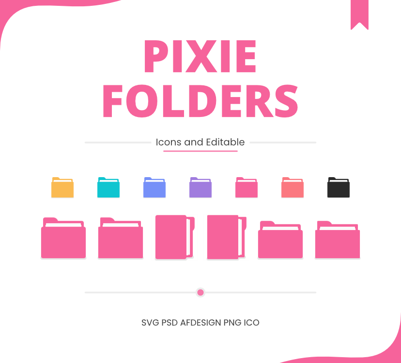
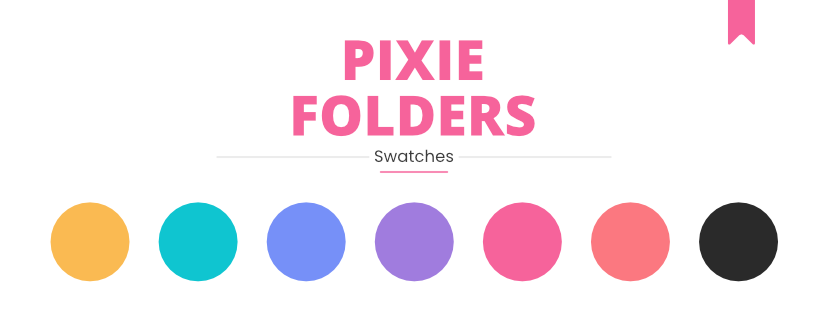

 

<h1 align="center">Pixie Folders</h1>

Set of six minimalist icon designs that include editable files.

 

 

Pixie Folders is a set of six minimalist icon designs that include editable files. Each one is created as pixel-perfect for the `Large icons` view, by customizing a Windows folder.

They are available in SVG, PSD, AFDESIFG, PNG and ICO formats. For these last two, a palette of seven colors was chosen considering light and dark mode; aqua, black, blue, pink, purple, salmon and yellow.

Made with 🩷 under [MIT LICENSE](LICENSE)
 

 

## Swatches

 

## Contributing
Big changes may not be made anymore. In any case, sets with new designs are welcome.

If you have any request, you can let me know.
