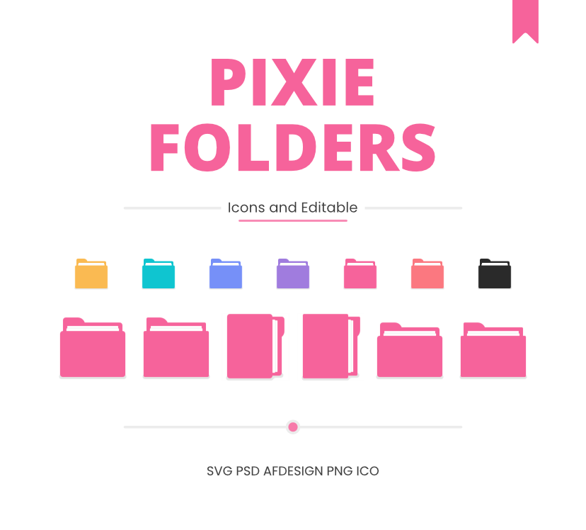

 

<h1 align="center">Q'zero Cursor</h1>

Black cursor with white border and danger style details for Windows.

 
 

Q'zero includes the Person and Pin cursors that were implemented in newer versions of Windows. Work and Busy cursors are animated, as the "danger" circle is spinning.

It's created to be used on both light and dark backgrounds due to the white border or faint shadow.

Made with 🤍 under <a href="LICENSE">MIT LICENSE</a>.

 

## Contributing

Big changes may not be made anymore since I have modified this cursor for about a year. In any case, sets with new designs are welcome.

If you have any request, you can let me know.

