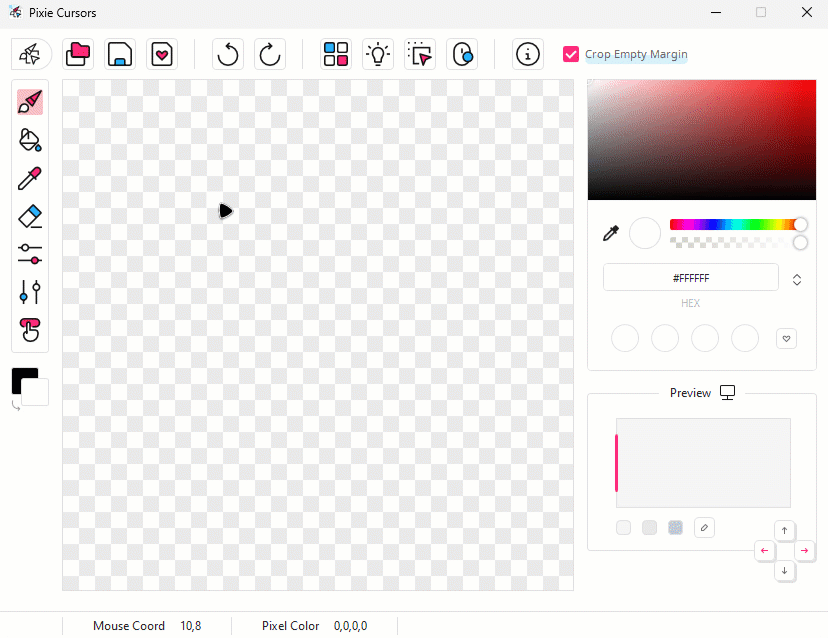

<h1 align="center">Droplet Screenmate</h1>

Droplet Screenmate, a pet running on your desktop.

 
 
  

<a href="README.md">English</a> :speech_balloon: <a href="README-es.md">Español</a>

## Features
* Your pet detects the taskbar and walks over it.
* You can drag and drop it anywhere else on your desktop.
* Different animations for walking, stopping, sitting, and dragging.
* Choose from 8 default skins.
* Options to change its walking speed.
* Option to start when you turn on your PC.
* You can create your own skin using the templates (PNG and editable).

## Preview

## Usage
All you have to do is run Droplet Screenmate.exe and you're done! Your pet will appear walking on your taskbar. Not only that, it also stops, sits, and you can even drag and drop it to change its position. In fact, it also has a special animation when you're dragging it.

Go to the icon in your system tray and right-click it:

**Options** will open the Pet Options window:

* In the _Skin_ section, just expand the dropdown menu, choose one, and click OK. That's it!

* To change how fast it walks and how long its strides are, go to the _Config_ section: the higher the Velocity value, the faster it will go. Step Size is how long its steps are; the lower the value, the shorter the steps. You can use these combinations when creating your custom skin, depending on whether it crawls, jumps, etc.

**Run at Startup**: Enable this option to launch the application when you turn on your PC. You can also disable it at any time. IMPORTANT: Once you enable this option, if you move the Droplet Screenmate folder, it will no longer launch with your PC, even if it's marked as active. You'll simply need to disable and then re-enable it.

**About**: MIT license, credits, and repository link.

**Exit**: Close the application. However, when you reopen it, your settings and skin will be the same as before, since everything is saved in Config.ini files.

 

  

## Contributing
* If you make comments in the code, preferably in Spanish, please.
* Variable names must be in English.
* If you open an **Issue**, it can be in English o Spanish.
* **Pull request** in English, in the description you can add details in English or Spanish.
* Due to the simplicity and optimization required in this application, no translations will be made.
  
## Config
`Config.ini` file stores skin info.

~~~
[Options]
Skin = Mushroom
~~~

El archivo `Config.ini` del skin almacena su propia configuración.

~~~
[Config]
Velocity = 0.2
Step size = 12
~~~

## Credits
Pixie Cursors is based on [PixelArtTool](https://github.com/unitycoder/PixelArtTool) under [MIT license](https://github.com/unitycoder/PixelArtTool/blob/master/LICENSE).

*You can find all licenses [here](/src/PixieCursors/Docs).*

## License
**MIT License**

Copyright (c) 2025 Génesis Toxical ([read here](LICENSE)).

 

## Related:
`❤️ Crystal Folders` Customize your folder icons in a few seconds: [`Download`](https://genesistoxical.github.io/crystal-folders/) or [`Repository`](https://github.com/genesistoxical/crystal-folders).

`❤️ Custom Folder` Create your own custom icon folder: [`genesistoxical.github.io/customfolder`](https://genesistoxical.github.io/customfolder/) or [`Repository`](https://github.com/genesistoxical/customfolder).

`❤️ Drop Icons` Utility to convert images to icons (.ico) for Windows: [`Download`](https://genesistoxical.github.io/drop-icons/) or [`Repository`](https://github.com/genesistoxical/drop-icons/).

`❤️ Image to Icon` Convert image to icon online: [`genesistoxical.github.io/imagetoicon`](https://genesistoxical.github.io/imagetoicon/) or [`Repository`](https://github.com/genesistoxical/imagetoicon).
