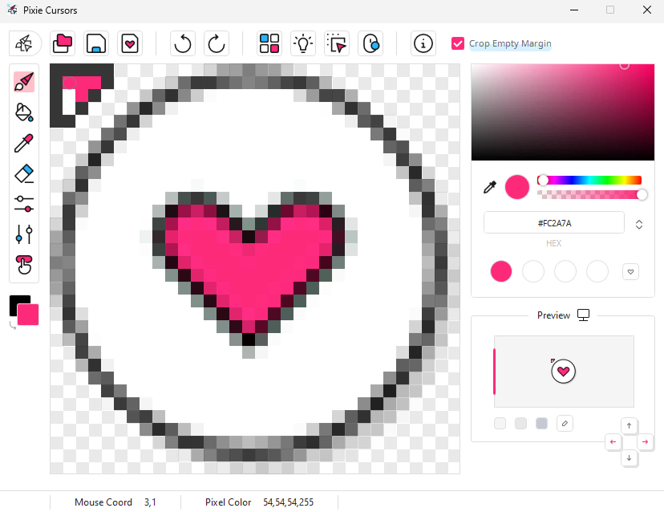
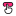
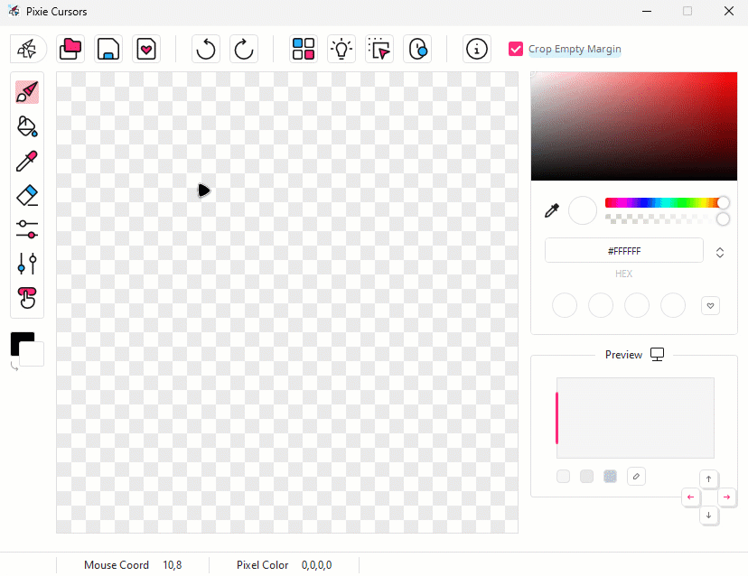

Pixie Cursors es una app para crear tus propios cursores personalizados, en Windows.

## Características
* Crea cursores en un par de minutos.
* Interfaz intuitiva y sencilla.
* Vista previa en tiempo y tamaño real.
* Importa una imagen en PNG y recorta píxeles vacíos.
* Elige en dónde hará clic el cursor (Hotspot).
* Selector de color que permite guardar muestras.
* Botón para agregar sombra al finalizar el cursor.
* El fondo a cuadros del editor se puede oscurecer.
* Accede a las herramientas con accesos del teclado.
* Cambia entre el idioma Inglés y Español.

## Previa
<picture></picture>

## Uso
El uso es muy sencillo, ya que es un editor como cualquier otro. Si tienes duda sobre una herramienta o botón, deja tu cursor encima de (sin dar clic) para obtener información.

- Abre una imagen  (debe ser en formato png). Los márgenes con pixeles vacíos se recortarán automáticamente.
- Comienza a crear la flechita; utiliza el pincel, selector de color y tu creatividad. Al seleccionar el pincel, puedes borrar con clic derecho también.
- Una vez terminado, podrías agregar sombra . Suele agregarse bastante sombreado a la flechita así que puedes perfeccionarla borrando un poco.
- Selecciona  de la barra de herramientas para elegir en dónde quieres que haga clic tu cursor, como por ejemplo, la punta de la flechita. Haz clic para dejar el circulito en el lugar que desees.
- Presiona el botón de guardar , ponle un nombre y ya lo habrás terminado. Ahora vamos a instalarlo...

**Instalación:**
- Abre tu carpeta de cursores con el botón  y mueve ahí el cursor que acabas de crear.
- Da clic en  el cual es solo un acceso directo a las Propiedades del Mouse de Windows.
- En la ventanita que se abrirá, dirígete a punteros, clic en **Selección normal** y `Examinar` para elegir uno diferente. Entra a la carpeta de **- Pixie Cursors -** y selecciona tu cursor. Puedes hacer lo mismo con el cursor de link o manita.
- Presiona `Guardar como…`, ponle un nombre y `Aceptar`.
- Desactiva la casilla de **Habilitar sombra en el puntero** para que no se ponga doble sombra, da en `Aceptar` ¡Y listo, disfruta tu cursor!

**Otras herramientas:**
- Si está activado **Cortar Margen Vacío** al momento de abrir una imagen, este va a recortarse para otener el mejor tamaño del cursor.
- Oprime `Shift` al usar el pixel para hacer una línea.
- Oprime `Ctrl` al usar el bote de pintura o **Rellenar** para pintar todos los pixeles del mismo color.

 

<picture></picture>

 

Dando click en , aparecerá una nueva ventana en la que puedes:

- **Cambiar el idioma:** En la sección inferior **Idioma**, haz clic en el icono de las flechitas para cambiar entre English, Español o Deutsch. Por último da clic en el botón de regresar para aplicar y ver los cambios.

- **Contenido de terceros:** En la parte izquierda están los nombres de cada librería, proyecto, iconos o tipografías que fueron utilizados, cliquea uno para leer su licencia y autor(a) o autores(as), además de una corta descripción. Puedes hacer clic sobre el icono de clip para ir al repositorio/sitio oficial de cada uno y cambiar de página con **Siguiente 🢖🢖** o **🢔🢔 Atrás**.

## Info
* Este software se encuentra bajo **MIT License** ([leer texto completo](https://github.com/genesistoxical/pixie-cursors/blob/master/LICENSE){:target="_blank"}).
* `❤️ Pixie Folders` Crea tus propios folders con este set de seis iconos editables: [Descargar](https://genesistoxical.github.io/pixie-folders/){:target="_blank"}.
* `❤️ Image to Icon` Convertir imagen a icono online: [imagetoicon.glitch.me](https://imagetoicon.glitch.me/){:target="_blank"}.
* `❤️ Drop Icons` Aplicación para convertir imágenes a iconos (.ico) para Windows: [Descargar](https://genesistoxical.github.io/drop-icons/){:target="_blank"}.
* Copyright (c) 2025 Génesis Toxical.

 

