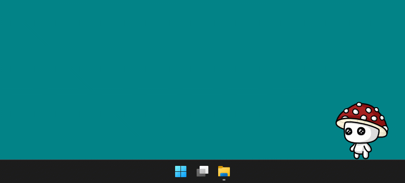

Droplet Screenmate, una mascota corriendo por tu escritorio.

## Características
* Tu mascota detecta la barra de tareas y camina por encima de ella.
* Puedes arrastrarlo y soltarlo en cualquier parte de tu escritorio.
* Animaciones diferentes al caminar, detenerse, sentarse y arrastrar.
* Elige entre los 8 skins por defecto.
* Opciones para cambiar la velocidad en la que camina.
* Opción de iniciar automáticamente al encender tu PC.
* Crea tu propio skin usando las plantillas (PNG y editables).

## Previa
<picture></picture>

## Uso
Lo único que debes hacer es ejecutar **Droplet Screenmate.exe**. ¡Y listo! Aparecerá tu mascota caminando sobre tu barra de tareas, no solo eso, también se detiene, se sienta e incluso basta con que lo arrastres y lo sueltes para cambiarlo de lugar. De hecho, también tiene una animación especial cuando lo estás arrastrando.

 

Dirígete al icono que está en tu bandeja, dale click derecho: 

**Options** abrirá la ventanita de opciones de la mascota:

* En el apartado de _Skin_, solo despliega, elige uno y da click en OK. ¡Eso es todo!
* Para cambiar qué tan rápido camina y qué tan largos da los pasos, ve al apartado de _Config_:
  * **Velocity**: Entre mayor sea el valor, más rápido se moverá.
  * **Step Size**: Entre menor sea el valor, más cortos serán los pasos.

  Puedes usar estas combinaciones al crear tu skin personalizado, dependiendo si se arrastra, si salta, etc.

**Run at Startup**: Actívala para que se inicie al momento que enciendes tu PC, puedes desactivarla también cuando desees. IMPORTANTE; una vez que actives esta opción, si vuelves a mover la carpeta de **Droplet Screenmate** de lugar ya no se iniciará con tu PC, aunque tenga el check. Únicamente debes desactivarla y activarla nuevamente.

**About**: Licencia MIT, créditos y enlace al respositorio.

**Exit**: Cierra la aplicación. Sin embargo, cuando vuelvas a abrirla nuevamente, tu configuración y skin seguirán siendo los mismos ya que todo se guarda en archivos _Config.ini_

 

<picture></picture>

## Crear tu propia mascota

Es muy fácil, solo deberás editar o crear 5 imágenes. Descarga la plantilla y descomprime el archivo ZIP, encontrarás algunas carpetas llamadas:
* Default - PNG, SVG, PSD y AF (Affinity).
* Outline - PNG, SVG y PSD

_Default_ está listo para ser decorado y _Outline_ es solamente el borde con ojitos. Elige el estilo y formato que requieras para empezar a editarlas; incluso puedes crear cualquier diseño de mascota siempre y cuando las dimensiones sean de 128 ⨯ 128 px.

Una vez que hayas editado **drag**, **idle**, **idleAlt**, **walk-1** y **walk-2**, deberás guardar cada una en formato PNG (sin reenombrarlas) dentro de una nueva carpeta, por ejemplo "Mi mascota". Posteriormente copia el archivo **Config.ini** y pégalo dentro esa carpeta que acabas de crear.

La configuración de tu nuevo skin la puedes editar en la aplicación y los cambios se van a guardar automáticamente. Recuerda que puedes compartir tu skin con cualquier persona una vez lo hayas terminado.

<picture></picture>

 

## Info
* Este software se encuentra bajo **MIT License** ([leer texto completo](https://github.com/genesistoxical/pixie-cursors/blob/master/LICENSE){:target="_blank"}).
* `❤️ Q'zero Cursor` Black cursor with danger style: [`Descarga`](https://genesistoxical.github.io/qzero-cursor/){:target="_blank"}.
* Copyright (c) 2026 Génesis Toxical.

 

