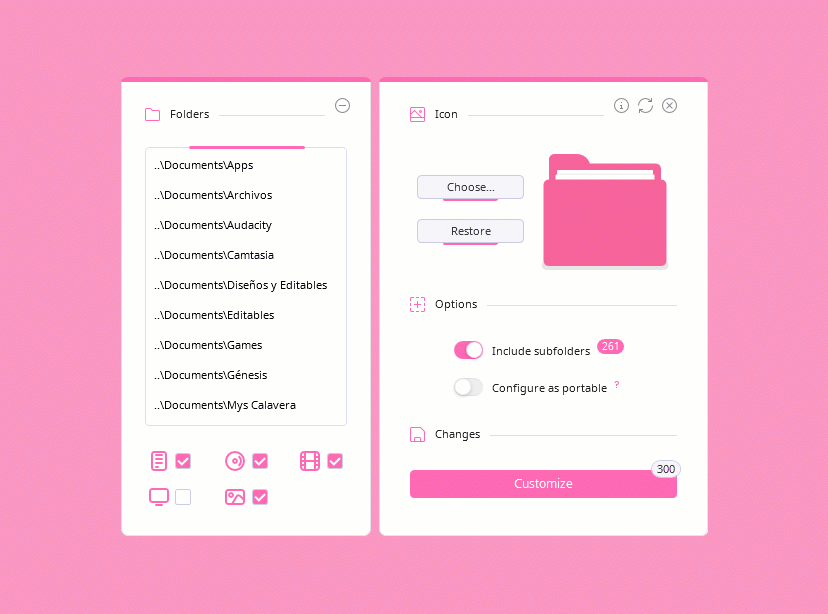
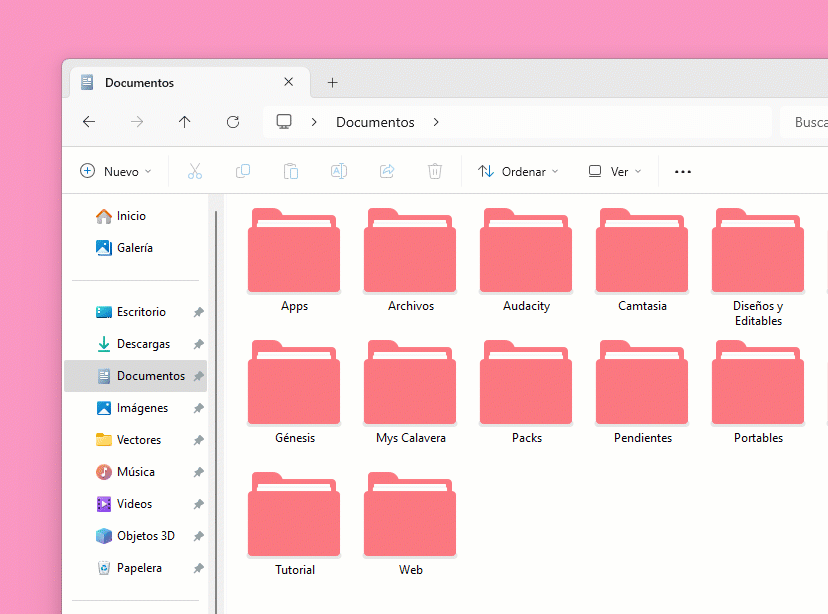

Crystal Folders es una aplicación para personalizar los iconos de tus carpetas en segundos, en Windows.

Crea o convierte tus carpetas con:

<a href="https://genesistoxical.github.io/customfolder/">Custom Folder</a><a href="https://genesistoxical.github.io/customfolder/">Image to Icon</a>

## Características
* Personaliza muchas carpetas en segundos.
* Agrega carpetas ubicadas dentro de Documentos, Imágenes, etc. con un clic.
* Posibilidad de arrastrar y soltar.
* Elegir entre siete colores de iconos predeterminados o uno propio.
* Opción para incluir subcarpetas.
* Posibilidad de quitar directorios de la lista una vez agregados.
* Muestra el número de carpetas y subcarpetas a personalizar.
* Opción para crear carpetas portables con icono personalizado.
* Evita la duplicación de carpetas que se han añadido previamente. 
* Notificaciones directamente en el escritorio.
* Evita la personalización de carpetas que usan iconos del sistema.
* Cambia entre el idioma Inglés y Español.
* Guarda la configuración en un archivo .ini, excepto para los switches.
* Personaliza el color del tema.
* Modificación del archivo Desktop.ini sin perder información.
* Esquinas adaptables (redondeadas o metro), dependiendo la versión del sistema operativo.

## Previa
<picture></picture>

## Uso
En el panel izquierdo hay un área donde se mostrará la lista de directorios o carpetas a personalizar. Más abajo encontrarás iconos con sus respectivas casillas, los cuales son: Documentos, Imágenes, Música, Videos y Escritorio.

 

𝟭. **Agregar carpetas**, existen dos formas:
* Activa la o las casillas que desees personalizar, por ejemplo: si seleccionaste _Documentos_, se agregarán a la lista todas las carpetas que se encuentran dentro. Puedes desactivarlas en cualquier momento para quitar esos directorios.
* Arrastrando y soltando carpetas en el área mencionada anteriormente, incluso si ya has activado casillas.

Para quitar carpetas una por una, debes seleccionarla en la lista y cliquear **⦵**.

𝟮. **Elegir un icono:**
   En el panel derecho oprime el botón `Elegir…`; se abrirá una pequeña ventana con siete colores de iconos predeterminados o podrías buscar y utilizar uno propio, solo debe estar en formato ICO. Una vez que lo selecciones y oprimas en `Abrir`, aparecerá en la vista previa.

𝟯. **Agregar subcarpetas:**
   Más abajo puedes activar el interruptor de `Agregar subcarpetas`, el cual también indicará la cantidad de subcarpetas totales. Si consideras que son demasiados o no te interesa, simplemente desactívalo (esto únicamente ayuda a tener una mejor experiencia de personalización).

 

>Vamos a omitir por ahora el segundo switch.

 

𝟰. **Personalizar todo:**
   Por último, oprime el botón `Personalizar` que, de igual manera, indica la cantidad total de carpetas a las que se les cambiará el icono. Hecho eso, se mostrará una pequeña ventana de espera y posteriormente, una notificación en tu escritorio confirmando que se ha completado correctamente.
   
Si la cantidad de carpetas supera los 600, se mostrará un mensaje preguntando si deseas continuar, sin embargo, el botón recomendado por defecto es `No` en caso de que prefieras disminuirla.
☑️ ¡Listo, así de fácil!, ya solo queda mirar tus carpetas personalizadas; en caso de no ver cambios, solo actualiza la ventana y/o escritorio.

Recuerda, para limpiar la lista o las opciones elegidas basta con hacer clic en **⟳**.

 

### Restaurar carpetas:

𝟭. Deberás seguir los primeros pasos nuevamente; activando las casillas o arrastrando y soltandolos a la lista. Solo que ahora en lugar de elegir un nuevo icono, deberás hacer clic en el botón `Restaurar` y como podrás notar aparecerá una flechita en lo que sería la vista previa para indicarnos dicha acción.

𝟮. El switch de abajo ha cambiado a `Restaurar subfolders`, actívalo en caso de que los hayas personalizado antes.

𝟯. Finalmente da clic en el botón `Restaurar`. Volverá a aparecer la pequeña ventana de espera, posteriormente la notificación en el escritorio de que se ha completado y listo, tus carpetas vuelven a ser normales.

 

<video controls><source src="https://github.com/user-attachments/assets/73cf3966-5187-4815-a3ec-11620f39fc35" type="video/mp4"></video>

 

### Carpetas con iconos personalizados en otra PC:

El segundo switch `Configurar a portable` permite personalizar el icono a máximo 30 carpetas (incluyendo subcarpetas) para que se muestren con ese icono en cualquier otra computadora, debido a que lo copia dentro. Esta opción solo funciona arrastrándolas al área de la lista; si hay alguna casilla activada del panel izquierdo, el switch no podrá activarse.

De la misma manera, al restaurar una carpeta con icono portable deberás seguir los mismos pasos, solo recuerda activar el switch `Restaurar de portable`.

 

### Botón de Info:

Dando click en el botón superior de Info, aparecerá una nueva ventana en la que puedes:

- **Cambiar el tema:** Haz clic sobre `Cambiar Tema` para abrir el selector de color y elegir uno personalizado, cuando lo tengas da clic en Aplicar. Para regresar al color por defecto repite los pasos anteriores y presiona el botón morado debajo del selector de tono, finalmente haz clic en Aplicar.

- **Cambiar el idioma:** En la sección inferior **Idioma**, haz clic en el icono de las flechitas para cambiar entre English o Español, por último da clic en el botón de regresar para aplicar y ver los cambios.

- **Contenido de terceros:** En la parte izquierda están los nombres de cada librería, proyecto, iconos o tipografías que fueron utilizados, cliquea uno para leer su licencia y autor(a) o autores(as), además de una corta descripción. Puedes hacer clic sobre el icono de clip para ir al repositorio/sitio oficial de cada uno y cambiar de página con **Siguiente 🢖🢖** o **🢔🢔 Atrás**.

 

<picture></picture>

 

### Medidas de seguridad:

* No puedes personalizar carpetas especiales que ya tengan un icono del sistema, como por ejemplo _Documentos_ o _Imágenes_, solo los directorios dentro del mismo.
* Hay carpetas a las que no se les puede cambiar el icono debido a su nivel de protección o privilegios, por lo tanto se mostrará una notificación en el escritorio avisando sobre cuántas se han omitido.
* Modifica directamente el archivo Desktop.ini, evitando así eliminarlo y creando uno nuevo sin perder información del mismo.
* Mensaje límite de carpetas, una vez superada la cantidad de 600; para desactivar este mensaje abre el archivo Config.ini y cambia `Message = true` por `Message = false`.

 

## Info
* Este software se encuentra bajo **MIT License** ([leer texto completo](https://github.com/genesistoxical/crystal-folders/blob/master/LICENSE){:target="_blank"}).
* `🤍 Custom Folder` Crea tu propia carpeta personalizada: [genesistoxical.github.io/customfolder](https://genesistoxical.github.io/customfolder/){:target="_blank"}.
* `🤍 Image to Icon` Convertir imagen a icono online: [genesistoxical.github.io/imagetoicon](https://genesistoxical.github.io/imagetoicon/){:target="_blank"}.
* `🤍 Drop Icons` Aplicación para convertir imágenes a iconos (.ico) para Windows: [Descargar](https://genesistoxical.github.io/drop-icons/){:target="_blank"}.
* Copyright (c) 2025 - 2026 Génesis Toxical.

 

