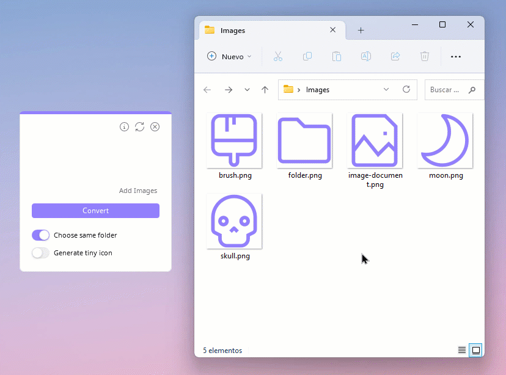
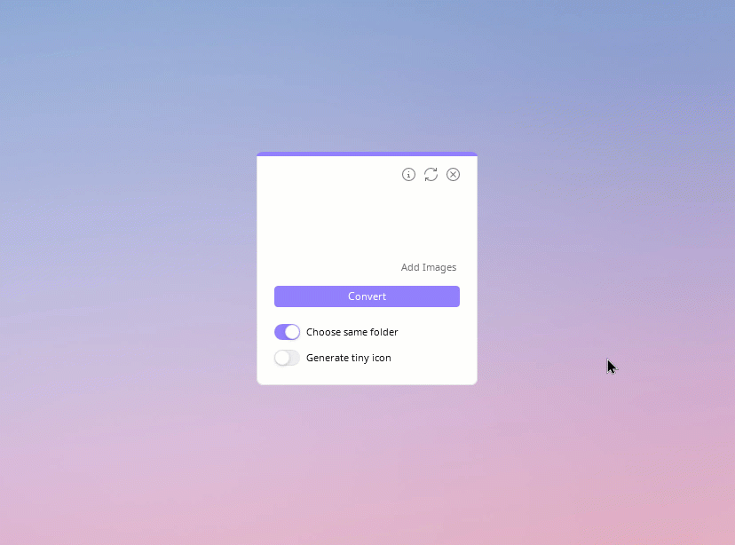

Drop Icons es una aplicación para convertir imágenes a iconos (.ico) para Windows, con una función simple de arrastrar y soltar.

Lenguajes Compatibles

‎‎ ‎ ‎ ‎ ‎ ‎ ‎ ‎ ‎ ‎ ‎ ‎ 

## Características
* Interfaz limpia e intuitiva.
* Convierte rápidamente muchas imágenes en iconos a la vez, con la función de arrastrar y soltar.
* Compatibilidad con imágenes .png .jpg .jpeg .jfif .bmp .gif y .svg
* Personaliza el color del tema.
* Número de las imágenes a convertir, restando tres que se muestran como vista previa.
* Guarda la configuración en un archivo .ini, excepto para los switches.
* Guarda los iconos en la misma carpeta (por defecto) o en una específica.
* Habilita y deshabilita Topmost.
* Opciones de formato para elegir los tamaños incluidos dentro del icono, múltiple y 256 px. [𝐢](#details)
* Evita la duplicación de una imagen que se ha añadido previamente.
* Opción para generar un icono mini.
* Esquinas adaptables (redondeadas o metro), dependiendo la versión del sistema operativo.

## Previa
<picture></picture>

## Uso
Arrastra y suelta tus imágenes en el espacio vacío, obtendrás una vista previa de tres imágenes excepto si solo arrastras una o dos. Más abajo puedes ver la cantidad total de imágenes a convertir, restando tres de la previa. Si no puedes arrastrar, cliquea en `Agregar`.

Deja el primer switch activado si deseas guardarlos en la misma carpeta, si prefieres elegir una carpeta específica, desactívalo. También puedes generar un icono mini activando el segundo switch. Por último, haz clic en el botón `Convertir`, espera a que la interfaz se reinicie porque eso indica que ha finalizado y tus iconos están listos.

Si necesitas eliminar las imágenes que agregaste por error, haz clic en el icono de las flechas. Recuerda que puedes arrastrar imágenes tantas veces como quieras antes de hacer clic en el botón `Convertir`.

 
Dando click en el botón superior de Info, aparecerá una nueva ventana en la que puedes:

- **Cambiar el tema:** Haz clic sobre `Cambiar Tema` para abrir el selector de color y elegir uno personalizado, cuando lo tengas da clic en Aplicar. Para regresar al color por defecto repite los pasos anteriores y presiona el botón morado debajo del selector de tono, finalmente haz clic en Aplicar.

- **Cambiar el idioma:** En la sección inferior **Idioma**, haz clic en el icono de las flechitas para cambiar entre English, Español o Deutsch. Por último da clic en el botón de regresar para aplicar y ver los cambios.
 
- **Formato:** Al hacer clic en `Formato` se desplegará un menú con dos opciones para elegir los tamaños que serán incluidos dentro del icono: **Múltiple** genera un icono de alta calidad que incluye todos los tamaños necesarios como 16, 32, 48, 64, 128 y 256 pixeles, aunque sus dimensiones mostrarán solo 16px. La ultima opción es **256 px** el cual genera un icono con un solo tamaño pero luce pixelado en la vista de detalles.
     >Nota: Si el switch **Generar icono mini** está activado, se creará un icono pequeño independientemente de su formato.

- **Contenido de terceros:** En la parte izquierda están los nombres de cada librería, proyecto, iconos o tipografías que fueron utilizados, cliquea uno para leer su licencia y autor(a) o autores(as), además de una corta descripción. Puedes hacer clic sobre el icono de clip para ir al repositorio/sitio oficial de cada uno y cambiar de página con **Siguiente 🢖🢖** o **🢔🢔 Atrás**.

 

Para elegir que Drop Icons esté encima de todas las ventanas (Topmost) o no, da clic derecho en cualquier lugar de la ventana principal y elige Habilitar Topmost o Deshabilitar Topmost.

## Opciones
<picture></picture>

## Info
* Drop Icons está basado en [Iconizer](https://github.com/willnode/Iconizer){:target="_blank"}. Lee más creditos [aquí](https://github.com/genesistoxical/drop-icons#credits){:target="_blank"}.
* German Translation por **uDEV2019**.
* Simplified Chinese Translation por **huqiu2**.
* French Translation por **logounet**.
* Este software se encuentra bajo **MIT License** ([leer texto completo](https://github.com/genesistoxical/drop-icons/blob/master/LICENSE){:target="_blank"}).
* Copyright (c) 2022 - 2025 Génesis Toxical.
 

