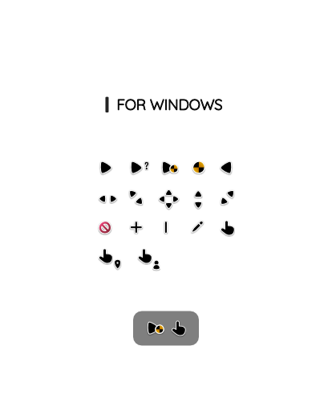

Q'zero includes the Person and Pin cursors that were implemented in newer versions of Windows. The "danger" or "toxic" style circle of the Work and Busy cursors are animated and rotate for better effect.

It can be used on light and dark backgrounds due to the white border or the Shadow. The installer in the same folder where the complete set is located.

## Usage
Drag and drop your images into the empty space, you will preview three images, except if you only drag one or two. Below you can see the total amount of images to convert (subtracting three from preview). If you cannot drag, click on `Add images`.

Leave the first switch on if you want to save them in the same folder, if you prefer to choose a specific folder, turn it off. You can also generate a tiny icon by turning on the second switch. Finally, click on `Convert` button, a loading circle will appear and as soon as everything is cleaned on the interface, you will have your icons created.

## Info
* This software is under **MIT License** ([read full license](https://github.com/genesistoxical/release-prueba/blob/master/LICENSE){:target="_blank"}).
* Copyright (c) 2022 Génesis Toxical.
