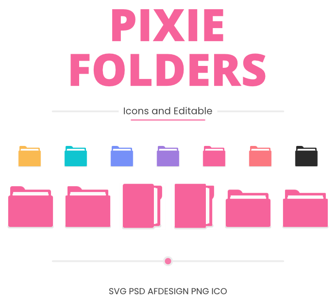

<picture></picture>

Pixie Folders is a set of three pairs of icon designs with their respective editable files. Each one is created as pixel perfect for the Large Icons view by customizing a Windows folder.

They are available in SVG, PSD, AFDESIFG, PNG and ICO formats. For these last two, a palette of seven colors was chosen considering light and dark mode; aqua, black, blue, pink, purple, salmon, yellow.

Made with 🖤 under [MIT License](https://github.com/genesistoxical/qzero-cursor/blob/master/LICENSE).
