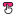

Droplet Screenmate, a pet running on your desktop.

## Features
* Your pet detects the taskbar and walks over it.
* You can drag and drop it anywhere else on your desktop.
* Different animations for walking, stopping, sitting, and dragging.
* Choose from 8 default skins.
* Options to change its walking speed.
* Option to start when you turn on your PC.
* You can create your own skin using the templates (PNG and editable).

## Preview
<picture></picture>

## Usage
It's very easy to use, as it's an editor like any other. If you have questions about a tool or button, hover over it (without clicking) to get information.

- Open an image  (it must be in PNG format). The margins with empty pixels will be automatically cropped.
- Start creating the arrow; use the brush, colorpicker and your creativity. Once you select the brush, you can also erase with a right-click.
- Once finished, you can add a shadow . A lot of shading is usually added to the arrow so you can refine it by erasing a bit.
- Select  from toolbar to choose where you want your cursor to click, such as the arrowhead. Click to place the circle where you want it.
- Press the save button , put it a name, and you're done. Now let's install it...

**Installation:**
- Open your cursors folder with the  button and move the cursor you just created there.
- Click , which is just a shortcut to the Windows Mouse Properties.
- In the window that opens, go to **Pointers**, click **Normal Selection** and `Browse` to choose a different one. Go to **- Pixie Cursors -** folder and select your cursor. You can do the same with the link or hand cursor.
- Press `Save As...`, put it a name and `OK`.
- Uncheck the **Enable Drop Shadow** box to avoid a double shadow, click `OK` and that's it! Enjoy your cursor!

**Other tools:**
- If **Crop Empty Margin** is enabled when opening an image, it will be cropped to get the best cursor size.
- Hold `Shift` when using brush to draw a line.
- Press `Ctrl` when using paint bucket or **Fill** to paint all pixels the same color.

 

<picture></picture>

 

By clicking on , a new window will appear in which you can:

- **Change language:** In the **Language** section below, click on the little arrows icon to change between English or Español. Finally click on the return button to apply and see changes.
     
- **Third-party content:** On the left side are the names of each library, project, icons or fonts that were used, click one to read its license and author(s), as well as a short description. You can click on the clip icon to go to each repository/official site and change pages with **Next 🢖🢖** or **🢔🢔 Back**.

## Info
* This software is under **MIT License** ([read full text](https://github.com/genesistoxical/pixie-cursors/blob/master/LICENSE){:target="_blank"}).
* `❤️ Custom Folder` Create your own custom icon folder: [`genesistoxical.github.io/customfolder`](https://genesistoxical.github.io/customfolder/){:target="_blank"}.
* `❤️ Image to Icon` Convert image to icon online: [`genesistoxical.github.io/imagetoicon`](https://genesistoxical.github.io/imagetoicon/){:target="_blank"}.
* `❤️ Crystal Folders` Customize your folder icons in a few seconds: [`Download`](https://genesistoxical.github.io/crystal-folders/){:target="_blank"}.
* Copyright (c) 2025 Génesis Toxical.

 

